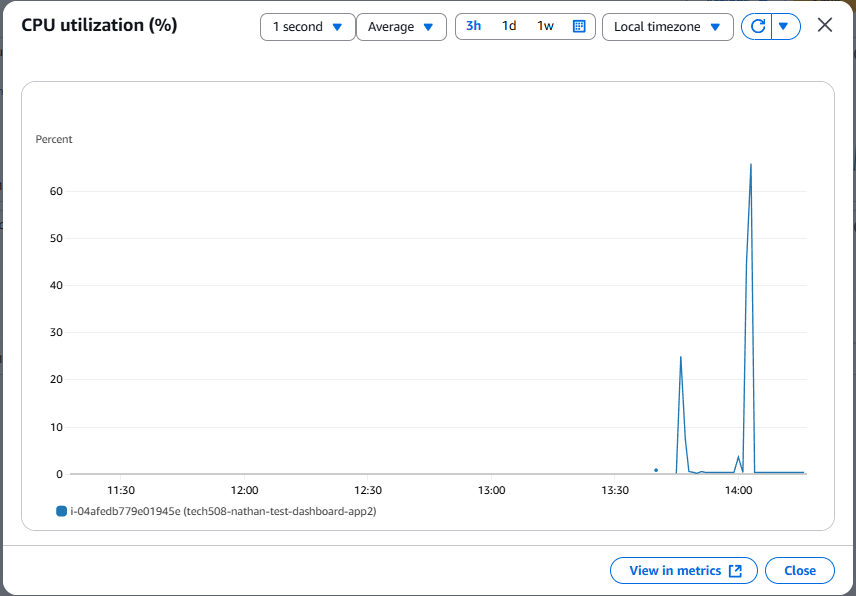
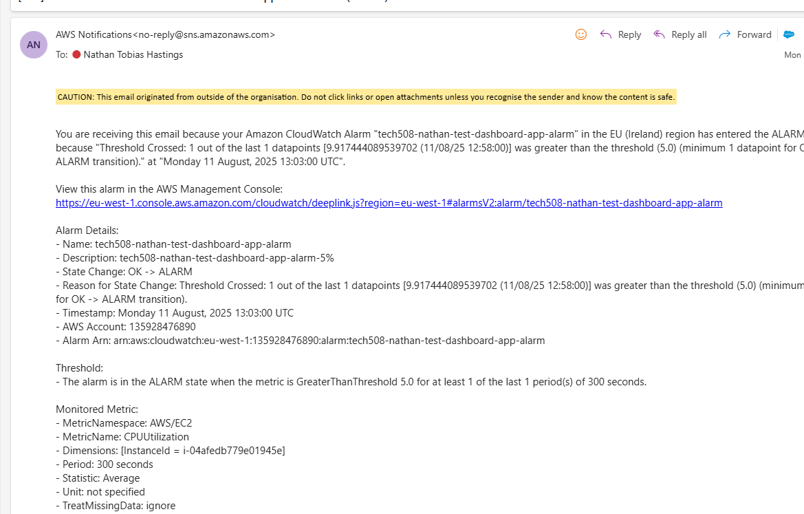

# Create a dashboard
### Why set up a dashboard
- monitors things
- we want updates every minute, not every five minutes
  - detailed monitoring, costs more money

1. Open app frontend
    - Launch instance from AMI
    - input appropriate user data
2. ssh in
   - must change the part of the paste where it says "root" to "ubuntu"
3. enable detailed monitoring
   - go to your instance > monitoring > manage detailed monitoring > enable > confirm
4. create new dashboard
   - three dots > add to dashboard > create new > tech508-nathan-test-dashboard > create > add to dashboard

### Increase CPU utilisation
- need to know how to do this so we can check notifications and alarms work
- refreshing the page a lot does not stress cpu much
- running sudo apt update and upgrade three times stresses cpu a bit more
- URL/fibonacci/30
- load test command
  - ab -n 1000 -c 100 http://34.244.217.139/
    - -n is number of requests
    - -c is size of groups

## CPU usage alarm setup

1. Cloudwatch console
2. Alarms > all alarms
3. Create alarm > select metric
4. in all metrics tab, choose EC2
5. Choose a metric category (e.g. per instance)
6. find your instance and the metric you want to monitor > select metric
7. Specify metric and conditions
   - statistic - average (means the average load has to be above threshold for the time period set)
   - choose a time period
8. Set conditions
   - static threshold type
   - State condition for notification
     - whenever CPU Utilisation is greater than 5
   - additional configuration
     - datapoints to alarm (how many evaluation periods must breach the threshold before the alarm triggers)
       - 1 out of 1 is usually fine, sometimes 2 out of 3
     - missing data treatment - defines how cloudwatch handles missing metric data points during evaluation
       - treat missing data as good or ignore works fine
    - next
9. Notification
    - In alarm
      - create or select a SNS topic for when the alarm is in alarm state
      - add email to notify
    - next
10. Enter name and description for alarm > next > preview > create alarm

### notification email
