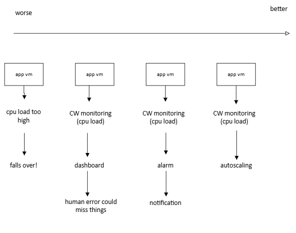
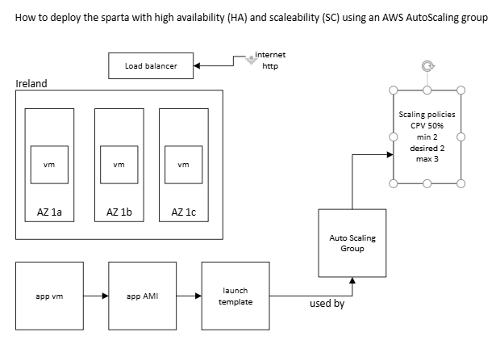

## Autoscaling

### Why use an AWS auto scaling group?

- if your cpu load is too high the app slows down resulting in loss of business to competitor apps or bad feedback

- could use cloud watch monitoring to watch the cpu load via a dashboard
  - danger with this is you might miss it

- solution to this could be to create an automatic alarm for certain thresholds

- best solution is to automatically scale the app when the need arises 

### Types of scaling
- vertical
  - give more memory
  - create a bigger virtual machine
  - then delete the old one
- horizontal
  - create more VMs

### How to deploy the Sparta app with HA and SC using an AWS Auto Scaling Group
- autoscaling group uses scaling policies
  - CPV 50%
  - minimum of 2 vms
  - desired 2 vms
  - max 3 vms
- using 3 availability zones (AZ) gives high availability
- load balancer
  - balances load between all the machines in the backend
  - distributes traffic
- understand how high availabiltiy and scaleability are valuable

note: add a new tag (name) for instances made from the launch template` 

### Launch template
1. provide name-convention and description
2. select my AMI
3. select instance type (t3.micro)
4. key pair login
5. appropriate security group
6. User data if needed

### Create Auto Scaling Group
1. choose launch template or configuration
   - name appropriately
   - select your launch template
2. choose instance launch options
   - AZs and subnets 
     - choose all the devops student default 1a,1b,1c
   - AZ distribution
     - leave on balanced best effort
3. integrate with other services (load balancer)
   - attach to a new load balancer
   - application load balancer (http)
   - tech508-nathan-app-asg-lb
   - listeners
     - port 80
     - create new target group
       - tech508-nathan-app-asg-lb-tg
   - health checks
     - turn on elastic load balancing health checks
     - health check grace period (usually leave 300 but 180 here)
4. configure group size and scaling
    - group size
      - 2 desired capacity
      - 2 min desired capacity
      - 3 max desired capacity
      - target tracking scaling policy
    - instance maintenance policy
      - fine to leave no policy
5. add notifications
    - can set up sms or email notifications if desired
6. add tags
    - name
    - tech508-nathan-app-asg-HA-SC
7. review

### To connect to the app
- load balancers > my load balancer > DNS name
- copy and paste it into browser
- this is distributing the traffic across the availability zones

### What happens when you delete a vm from the ASG
- takes a few seconds to recover
- a second instance is created to make sure the minimum of 2 is still met

### Deleting ASG
- select your ASG > actions > delete
- have to manually do the same for load balancer and target groups

### Notes
- If you try to modify the user datac it will not actually save, so you have to find a way to actually modify it (edit user data) or create a new one with the environment variable set with the db private ip.