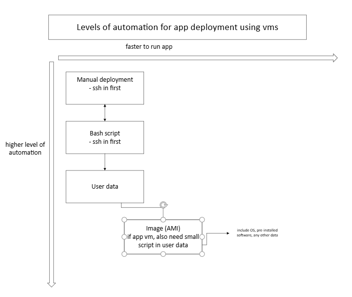
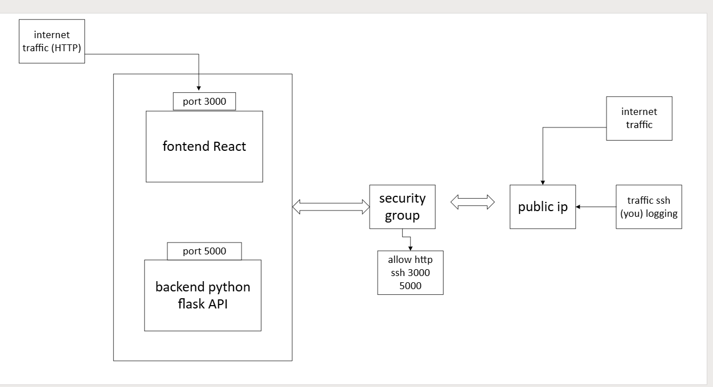

- [Automated deployment of app on EC2 instance](#automated-deployment-of-app-on-ec2-instance)
  - [App VM](#app-vm)
    - [Create repo](#create-repo)
    - [launch instance](#launch-instance)
    - [Front end script commands and functions](#front-end-script-commands-and-functions)
  - [Database VM](#database-vm)
    - [create instance](#create-instance)
    - [Database script commands and functions](#database-script-commands-and-functions)
  - [configuring the reverse proxy](#configuring-the-reverse-proxy)
  - [using pm2](#using-pm2)
  - [user data](#user-data)
  - [Levels of automation for app deployment using VMs](#levels-of-automation-for-app-deployment-using-vms)
  - [understanding of how the app works](#understanding-of-how-the-app-works)
  - [Creating new vms from AMIs](#creating-new-vms-from-amis)

# Automated deployment of app on EC2 instance
## App VM
### Create repo
1. Download and unzip the zip folder
2. cut the app folder
3. paste inside a new git repository folder "tech508_sparta_app"
4. create a new github repo by the same name

in gitbash:
- cd into tech508_sparta_app
- `git init`
- `git status`
- `git add .`
- `git commit -m ""`
- `git branch -M main`
- `git remote add origion <url>`
- `git push -u origin main`
- confirm you can see app folder in github

### launch instance
- name convention includes some sort of indication as to the environment - test or prod
- ubuntu server 22.04 LTS
- t3.micro
- security
  - allow http
  - allow TCP 3000 from anywhere

### Front end script commands and functions

1. no interact versions of update and upgrade
- `sudo DEBIAN_FRONTEND=noninteractive apt-get update -y`
- `sudo DEBIAN_FRONTEND=noninteractive apt-get upgrade -yq`

2. install nginx
- `sudo apt-get install nginx -y`

3. configure reverse proxy using nginx
- `sudo sed -i '/try_files/s|try_files .*;|proxy_pass http://localhost:3000;|' /etc/nginx/sites-available/default`

4. Restart nginx
- `sudo systemctl restart nginx`

5. installing NodeJS v20 (installs node and npm commands)
- `sudo DEBIAN_FRONTEND=noninteractive bash -c "curl -fsSL https://deb.nodesource.com/setup_20.x | bash -" && \sudo DEBIAN_FRONTEND=noninteractive apt-get install -y nodejs`

6. verify nodejs version
- `node -v`

7. download app code
- github repo > code > copy path
- `git clone https://github.com/nathanhastings412/tech508_sparta_app repo`
- can remove the .git and add " repo" to copy into a new folder called repo

8. cd into app folder
- `cd repo/app`

9. install pm2
- `sudo npm install -g pm2`

10. set env var for connection to database
- `export DB_HOST=mongodb://<privateipdb>:27017/posts`

11. install packages for app
- `npm install`

12. start app
- `npm start`
- to start app in background
- `nohup npm start &` 
  - nohup means no hangup - it will not hang up even if the instance stops
  - & puts the command in the background, so the terminal remains usable
- kill process by locating it
  - `lsof -i :3000`
- then killing it
  - `kill PID`
- can also use pm2
  - `pm2 kill`
  - `pm2 start npm --name "my-app" -- start`
  - `pm2 save`

## Database VM

### create instance
- AMI ubuntu 22.04
- t3.micro
- security
  - ssh
  - customTCP 27017 from anywhere (mongodb)
- ssh in

### Database script commands and functions
1. update and upgrade packages
- `sudo apt-get udpate`
- `sudo apt upgrade -y`

2. install gnupg and curl
- `sudo apt-get install gnupg curl`

3. import mongoDB public GBG key
- `curl -fsSL https://www.mongodb.org/static/pgp/server-7.0.asc |    sudo gpg -o /usr/share/keyrings/mongodb-server-7.0.gpg    --dearmor`

4. Create list file
- `echo "deb [ arch=amd64,arm64 signed-by=/usr/share/keyrings/mongodb-server-7.0.gpg ] https://repo.mongodb.org/apt/ubuntu jammy/mongodb-org/7.0 multiverse" | sudo tee /etc/apt/sources.list.d/mongodb-org-7.0.list`

5. reload package database
- `sudo apt-get update`

6. install mongoDB community server FIX!
- `sudo apt-get install -y \
   mongodb-org=7.0.22 \
   mongodb-org-database=7.0.22 \
   mongodb-org-server=7.0.22 \
   mongodb-mongosh \
   mongodb-org-shell=7.0.22 \
   mongodb-org-mongos=7.0.22 \
   mongodb-org-tools=7.0.22 \
   mongodb-org-database-tools-extra=7.0.22`

7. check status of mongo
- `sudo systemctl status mongod`

8. cd into etc folder
- `cd /etc`
- `ls`

9. edit text of mongo.conf after making backup
- `sudo cp mongo.conf mongo.conf.bk`
- `sudo nano mongo.conf`

10. edit bindip from 127.0.0.1 to 0.0.0.0
- start and enable mongodb
  - `sudo systemctl start mongod`
  - `sudo systemctl enable mongod`
- or use sed to change it in the script
  - `sudo sed -i 's/^\s*bindIp:\s*127\.0\.0\.1/  bindIp: 0.0.0.0/' /etc/mongod.conf`
- status check

11. set variable in frontend vm
- `export DB_HOST=mongodb://<privateipdb>:27017/posts`

12. refresh npm install
- `npm install`

13. start npm
- `npm start`

## configuring the reverse proxy
- public ip address allows http through port 80 through to nginx but this will take you through to port 3000 without having to type :3000 in the url
- nginx takes care of redirecting the traffic to port 3000
- restart mongod
- change configuration file in nginx
- restart nginx
- `cd /etc/nginx/sites-available`
- `sudo cp /etc/nginx/sites-available/default /etc/nginx/sites-available/default.bk`
- `sudo nano default
replace try_files $uri $uri/ =404; with proxy_pass http://localhost:3000`
- `sudo systemctl restart nginx`
- `sudo systemctl status nginx`

## using pm2
- install pm2 
  - `sudo npm install -g pm2`
- start app the first time
  - `pm2 start npm --name "my-app" -- start`
- stop app
  - `pm2 stop my-app`
- restart app
  - `pm2 start my-app`

## user data
- make sure scripts are working
- input db private ip into the app env var
- wait
- use the public app ip to find the page

## Levels of automation for app deployment using VMs

## understanding of how the app works

## Creating new vms from AMIs
- create images from working user data vms
  - instance > action > images and templates > create image >
  - give name convention
- create vm from the images
  - configure appropriate security groups
  - for app vm:
    - small script to
      - shebang
      - set environment variable (with db private ip)
      - cd into app folder
      - `npm install`
      - `pm2 stop all`
      - `pm2 start app.js`