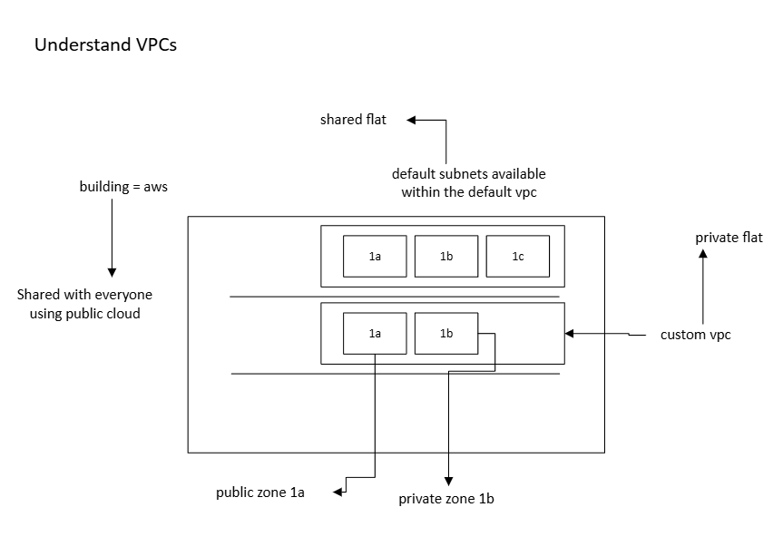

# Increase database security
## VPC
### What is a vpc?
- Virtual Private Cloud
- in your custom vpc you get to decide whether subnets are private public
- 

## architecture for custom vpc for deploying sparta app with better database security

What is a cidr block?
- 10.0.0.0/16
- 8-bits for each number
- 32 bits in total for ipv4
- each number can range from 0-255
- the 16 refers to the first 16 bits (the first two numbers) being locked - they will not change
- the second two numbers can be used and changed for vpc
- this gives us over 65000 bits of space to use

## Using custom vpc to deploy sparta app with better database security
1. Create VPC
   - VPC only
   - tech508-nathan-2tier-vpc1
   - IPv4 CIDR
     - 10.0.0.0/16
2. Create the subnets
    - select vpc (from step 1)
    - add public subnet
      - tech508-nathan-public-subnet
      - CIDR block
        - 10.0.2.0/24
    - add private subnet
      - tech508-nathan-private-subnet
      - CIDR block
        - 10.0.3.0/24
3. Internet gateway
   - tech508-nathan-2tier-vpc1-ig
   - attach internet gateway to vpc
4. Routing table
   - tech508-nathan-2tier-vpc1-public-rt
   - select vpc
   - actions > edit subnet associations > save association with public subnet
   - edit route > add route
   - destination
     - anywhere
   - target
     - internet gateway
     - in drop down, select your internet gateway
5. DB vm
   - Launch instance from DB AMI
   - tech508-nathan-vpc-db
   - for security, should not allow ssh in security group
   - edit
     - select vpc
     - select private subnet
     - disable assign public ip
     - new security group
     - tech508-nathan-2tier-vpc1-db
     - only allow mongo custom tcp
     - source type should be ip 
6. app vm
   - launch instance from app AMI
   - tech508-nathan-2tier-vpc1-app
   - edit security group
     - select vpc
     - select public subnet
     - enable assign public ip
     - allow ssh from my IP
     - allow http from anywhere
     - dont need port 3000 if reverse proxy works
   - input user data
     - shebang
     - env variable
     - `cd repo/app`
     - `pm2 start app.js`